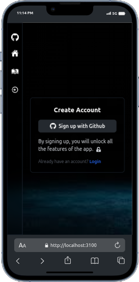
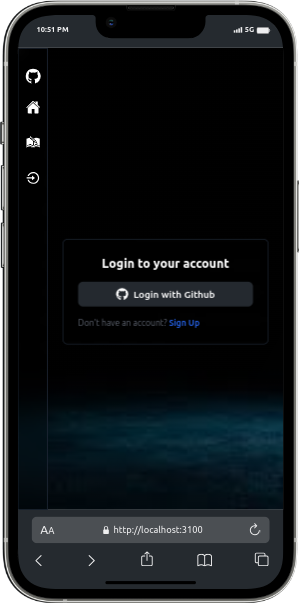
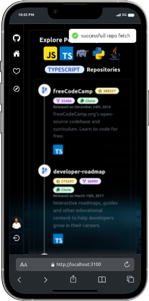
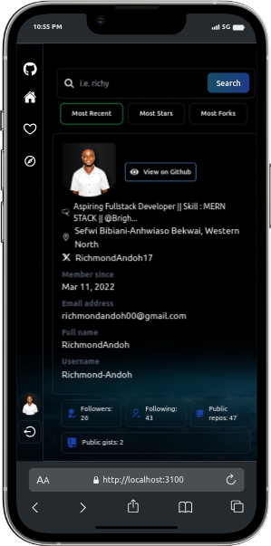

# CodeNest

CodeNest is a GitHub-like web application built using the MERN stack, which includes MongoDB, Express.js, React, and Node.js. It allows users to explore programming languages and repositories, view user profiles with all repositories, and like user profiles (authentication required). This project demonstrates proficiency in web development, including user authentication using Passport.js, data fetching from APIs, and responsive design.


## Features

- **User Authentication:** Secure user authentication system implemented using Passport.js, allowing users to sign up, log in, and log out.
- **Explore Programming Languages:** Browse through various programming languages and discover repositories associated with each language.
- **View User Profiles:** Access user profiles and view all repositories associated with a particular user.
- **Like User Profiles:** Authenticated users can like user profiles, adding them to their liked list for future reference.
- **Responsive Design:** Fully responsive layout ensures optimal viewing experience across devices and screen sizes.

## Technologies Used

- **Frontend:** React.js, React Router, Axios, Bootstrap (DaisyUI for Tailwind CSS)
- **Backend:** Node.js, Express.js
- **Database:** MongoDB Atlas
- **Authentication:** Passport.js (GitHub strategy)
- **APIs:** GitHub API for fetching user profiles and repositories
- **Deployment:** Heroku for backend, Netlify for frontend

## Installation

```
  1. Clone the repository:

    git clone https://github.com/Richmond-Andoh/CodeNest.git

  2. Navigate to the project directory:

    cd CodeNest

  3. Install dependencies:

    npm install

  4.  Set up environment variables:Create a .env file in the root directory and add the following:

    PORT=3000
    MONGODB_URI=<mongodb-uri>
    GITHUB_CLIENT_ID=<github-client-id>
    GITHUB_CLIENT_SECRET=<github-client-secret>
    SESSION_SECRET=<session-secret>

  5.  Start the developement server:

    npm run dev

  6. visit http://localhost:3001

```

## Usage

- **Sign Up:** Create a new account using the Sign Up form.

 

- **Log In:** Log in to your account with your credentials.

 

- **Explore:** Browse through various programming languages and repositories.

 

- **View User Profiles:** Click on user profiles to view all repositories associated with a particular user.

 

- **Like Profiles:** Authenticated users can like user profiles, adding them to their liked list.


## Contributing
Contributions are welcome! Please fork the repository and submit a pull request for any enhancements or bug fixes.

## License
This project is licensed under the MIT License.

## Acknowledgements
Icons made by Iconfinder
Special thanks to CodeNinja for inspiration and guidance.

## Contact
For inquiries or support, please email [richmondandoh00@gmail.com].

